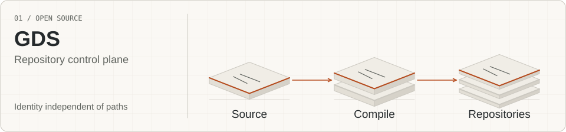
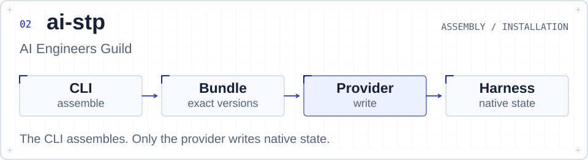
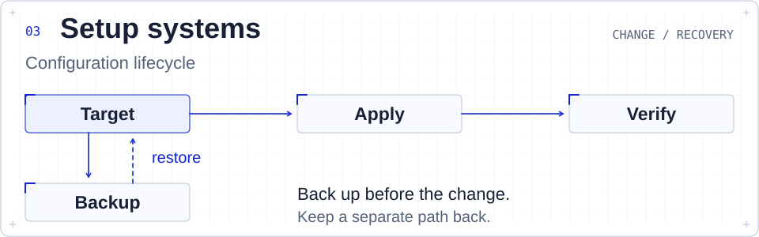
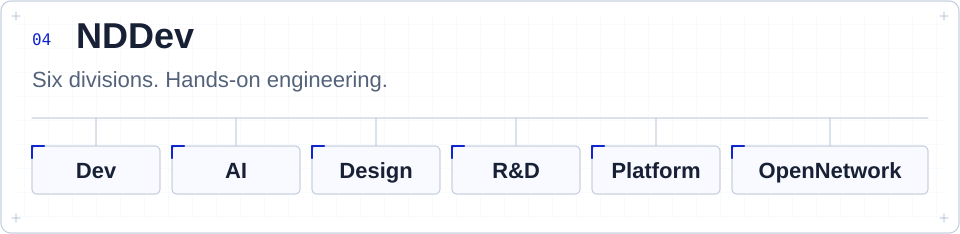

# Danil Silantyev

**AI Staff Engineer · Systems & AI Architect**  
OSS developer & contributor. CEO at [NDDev](https://nddev.it.com).

I build AI systems, agent workflows and developer tools, from architecture to implementation.

[Email](mailto:danil@nddev.it.com) · [Telegram](https://t.me/Danil_Silantyev) · [LinkedIn](https://www.linkedin.com/in/danil-silantyev-ai/)

## What I work with

### Languages

**Rust · Python · Go · C / C++ · TypeScript · Dart (Flutter)**  
Also JavaScript, SQL and shell scripting.

### Seven coding harnesses

**Claude Code · Codex · Grok Build · Pi · OpenCode · Cursor · Antigravity**

I work on the configuration around the model: instructions, skills, MCP servers,
LSP integration, hooks, commands, subagents and plugins. Each harness gets its
own native setup, not a copy of another tool's configuration.

### Agent tooling

| Area | Tools I use |
| --- | --- |
| API routing | [CLIProxyAPI](https://github.com/router-for-me/CLIProxyAPI), LiteLLM, OpenRouter |
| Design & code review | [Impeccable](https://github.com/pbakaus/impeccable), [Ponytail](https://github.com/DietrichGebert/ponytail), custom skills and rules |
| Context & code intelligence | `ctx`, Serena, Context7, DeepWiki, grep.app, LSP |
| MCP integrations | GitHub, Figma, shadcn, Dart/Flutter, Chrome DevTools, sequential-thinking, OpenAI Docs |
| Browser work | Playwright CLI, Chrome DevTools MCP |

### Application stack

| Area | Selected technologies |
| --- | --- |
| AI & ML | LangGraph, LangChain, PyTorch, scikit-learn, Hugging Face, OpenCV |
| Inference & RAG | vLLM, ONNX, Qdrant, hybrid search, reranking |
| Backend & interfaces | FastAPI, React, Next.js, Node.js, Flutter |
| Data & storage | PostgreSQL, ClickHouse, Redis, Meilisearch, RustFS |
| Delivery & observability | Linux, macOS, Docker, GitHub Actions, OpenTelemetry, Prometheus, Grafana |
| Experiments & evaluation | MLflow, Weights & Biases, Optuna, Langfuse, LangSmith |

My work includes multi-agent orchestration, RAG, computer vision and MLOps.
I use explicit service boundaries, OLTP/OLAP separation and transactional outboxes
where the problem calls for them.

## Selected open-source work

<a href="https://github.com/NDDev-OpenNetwork/github-device-sync">
<picture>
  <source media="(max-width: 640px) and (prefers-color-scheme: dark)" srcset="assets/profile/gds-dark-mobile.svg">
  <source media="(max-width: 640px)" srcset="assets/profile/gds-light-mobile.svg">
  <source media="(prefers-reduced-motion: no-preference) and (prefers-color-scheme: dark)" srcset="assets/profile/gds-dark-motion.svg">
  <source media="(prefers-reduced-motion: no-preference)" srcset="assets/profile/gds-light-motion.svg">
  <source media="(prefers-color-scheme: dark)" srcset="assets/profile/gds-dark.svg">
  
</picture>
</a>

**[GDS](https://github.com/NDDev-OpenNetwork/github-device-sync)** · Repository control plane  
I build tools for keeping repository identity, policies and agent context consistent across devices. A checkout path is a location, not an identity.

<a href="https://github.com/ai-engineers-guild/ai-stp">
<picture>
  <source media="(max-width: 640px) and (prefers-color-scheme: dark)" srcset="assets/profile/ai-stp-dark-mobile.svg">
  <source media="(max-width: 640px)" srcset="assets/profile/ai-stp-light-mobile.svg">
  <source media="(prefers-color-scheme: dark)" srcset="assets/profile/ai-stp-dark.svg">
  
</picture>
</a>

**[ai-stp](https://github.com/ai-engineers-guild/ai-stp)** · AI Engineers Guild  
I work on architecture, the CLI and integrations. The CLI assembles versioned setups; providers write the harness configuration.

<a href="https://github.com/NDDev-OpenNetwork/codex-setup-system">
<picture>
  <source media="(max-width: 640px) and (prefers-color-scheme: dark)" srcset="assets/profile/setup-dark-mobile.svg">
  <source media="(max-width: 640px)" srcset="assets/profile/setup-light-mobile.svg">
  <source media="(prefers-color-scheme: dark)" srcset="assets/profile/setup-dark.svg">
  
</picture>
</a>

**[Setup systems](https://github.com/NDDev-OpenNetwork/codex-setup-system)** · NDDev OpenNetwork  
Configuration tools for the seven harnesses above: explicit targets, backups and recovery. Start with the Codex implementation.

## At NDDev

I lead NDDev and stay hands-on with architecture and code.

<a href="https://nddev.it.com">
<picture>
  <source media="(max-width: 640px) and (prefers-color-scheme: dark)" srcset="assets/profile/nddev-dark-mobile.svg">
  <source media="(max-width: 640px)" srcset="assets/profile/nddev-light-mobile.svg">
  <source media="(prefers-color-scheme: dark)" srcset="assets/profile/nddev-dark.svg">
  
</picture>
</a>

Dev · AI · Design · R&D · Platform · OpenNetwork

## Selected client work

Almaty Customs · Almaty City Libraries

## Get in touch

Have a project or an engineering role in mind? [Email me](mailto:danil@nddev.it.com) or [message me on Telegram](https://t.me/Danil_Silantyev).

Using one of these tools? Star its repository or open an issue with what you need.

Other languages

[Русский](README.ru.md)

