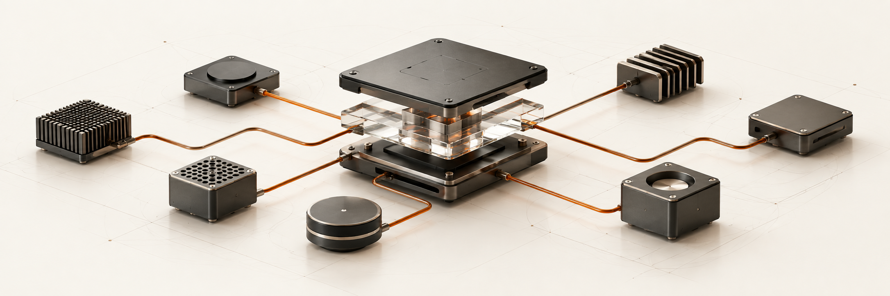

# Danil Silantyev

**AI Staff-level Engineer · CEO [NDDev](https://nddev.it.com)**  
AI systems, agent tooling and infrastructure. I design the architecture and write the code.

[Email](mailto:danil@nddev.it.com) · [Telegram](https://t.me/Danil_Silantyev) · [Engineering notes](https://t.me/rldyourmnd) · [LinkedIn](https://www.linkedin.com/in/danil-silantyev-ai/) · [Русский](README.ru.md)

<picture>
  <source media="(max-width: 767px) and (prefers-color-scheme: dark)" srcset="assets/profile/assembly-dark-mobile.png">
  <source media="(max-width: 767px)" srcset="assets/profile/assembly-light-mobile.png">
  <source media="(prefers-color-scheme: dark)" srcset="assets/profile/assembly-dark.png">
  
</picture>

## What I work with

### Languages

**Rust · Python · Go · C / C++ · TypeScript · Dart (Flutter)**  
Also JavaScript, SQL and shell.

### Seven coding harnesses

**Claude Code · Codex · Grok Build · Pi · OpenCode · Cursor · Antigravity**

Native instructions, skills, MCP, LSP, hooks, commands, subagents and plugins, adapted to each harness.

| Agent workbench | Tools I use |
| --- | --- |
| Routing | [CLIProxyAPI](https://github.com/router-for-me/CLIProxyAPI) · LiteLLM · OpenRouter |
| Skills & review | [Impeccable](https://github.com/pbakaus/impeccable) · [Ponytail](https://github.com/DietrichGebert/ponytail) · custom skills |
| Context | `ctx` (agent session viewer) · Serena · Context7 · DeepWiki · grep.app |
| MCP & browser | GitHub · Figma · shadcn · Dart/Flutter · Chrome DevTools · Playwright CLI · sequential-thinking · OpenAI Docs |

## Selected open-source work

<a href="https://github.com/NDDev-OpenNetwork/github-device-sync">
<picture>
  <source media="(max-width: 767px) and (prefers-color-scheme: dark)" srcset="assets/profile/gds-dark-mobile.svg">
  <source media="(max-width: 767px)" srcset="assets/profile/gds-light-mobile.svg">
  <source media="(prefers-reduced-motion: no-preference) and (prefers-color-scheme: dark)" srcset="assets/profile/gds-dark-motion.svg">
  <source media="(prefers-reduced-motion: no-preference)" srcset="assets/profile/gds-light-motion.svg">
  <source media="(prefers-color-scheme: dark)" srcset="assets/profile/gds-dark.svg">
  
</picture>
</a>

**[GDS](https://github.com/NDDev-OpenNetwork/github-device-sync)** · I build the control plane for repository identity, policy and agent context across devices.

<a href="https://github.com/ai-engineers-guild/ai-stp">
<picture>
  <source media="(max-width: 767px) and (prefers-color-scheme: dark)" srcset="assets/profile/ai-stp-dark-mobile.svg">
  <source media="(max-width: 767px)" srcset="assets/profile/ai-stp-light-mobile.svg">
  <source media="(prefers-reduced-motion: no-preference) and (prefers-color-scheme: dark)" srcset="assets/profile/ai-stp-dark-motion.svg">
  <source media="(prefers-reduced-motion: no-preference)" srcset="assets/profile/ai-stp-light-motion.svg">
  <source media="(prefers-color-scheme: dark)" srcset="assets/profile/ai-stp-dark.svg">
  
</picture>
</a>

**[ai-stp](https://github.com/ai-engineers-guild/ai-stp)** · Architecture, CLI and integrations. A shared project at **AI Engineers Guild**.

<a href="https://github.com/NDDev-OpenNetwork/codex-setup-system">
<picture>
  <source media="(max-width: 767px) and (prefers-color-scheme: dark)" srcset="assets/profile/setup-dark-mobile.svg">
  <source media="(max-width: 767px)" srcset="assets/profile/setup-light-mobile.svg">
  <source media="(prefers-reduced-motion: no-preference) and (prefers-color-scheme: dark)" srcset="assets/profile/setup-dark-motion.svg">
  <source media="(prefers-reduced-motion: no-preference)" srcset="assets/profile/setup-light-motion.svg">
  <source media="(prefers-color-scheme: dark)" srcset="assets/profile/setup-dark.svg">
  
</picture>
</a>

**[Setup systems](https://github.com/NDDev-OpenNetwork/codex-setup-system)** · My configuration tools for seven harnesses. Explicit targets, complete backups and restore.

Also: [CI workflows](https://github.com/NDDev-OpenNetwork/ci-workflows) · [agent-runtime](https://github.com/NDDev-OpenNetwork/agent-runtime) · [nremote](https://github.com/NDDev-OpenNetwork/nremote) (RustDesk fork).

## Application stack

| Area | Working set |
| --- | --- |
| AI & ML | LangGraph · LangChain · PyTorch · scikit-learn · Hugging Face · OpenCV |
| Inference & RAG | vLLM · ONNX · Qdrant · hybrid search · reranking |
| Backend & UI | FastAPI · React · Next.js · Node.js · Flutter |
| Data | PostgreSQL · ClickHouse · Redis · Meilisearch · RustFS |
| Delivery | Linux · macOS · Docker · GitHub Actions · OpenTelemetry · Prometheus · Grafana |
| Evaluation | MLflow · Weights & Biases · Optuna · Langfuse · LangSmith |

## Where the projects live

Most of my work lives in organizations. I'm a GitHub owner in each of these:

| Organization | Focus |
| --- | --- |
| [NDDev OpenNetwork](https://github.com/NDDev-OpenNetwork) | Open-source tools, setup systems, CI/CD |
| [NDDev](https://github.com/NDDev-it-com) | Engineering studio and client work |
| [NDDev Platform](https://github.com/NDDev-Platform) | Product platform |
| [AI Engineers Guild](https://github.com/ai-engineers-guild) | Shared engineering projects, including ai-stp |
| [My Attention AI](https://github.com/My-Attention-AI-Inc) | Separate company, outside NDDev |
| [NDDev Archive](https://github.com/NDDev-Archive) | Retired projects and earlier experiments |

## Selected client work

Almaty Customs · Almaty City Libraries

## Get in touch

Building an AI system, growing an engineering team, or exploring a partnership? **[Write to me](https://t.me/Danil_Silantyev).**

[Follow my notes](https://t.me/rldyourmnd), explore the code, and star the projects you find useful.
